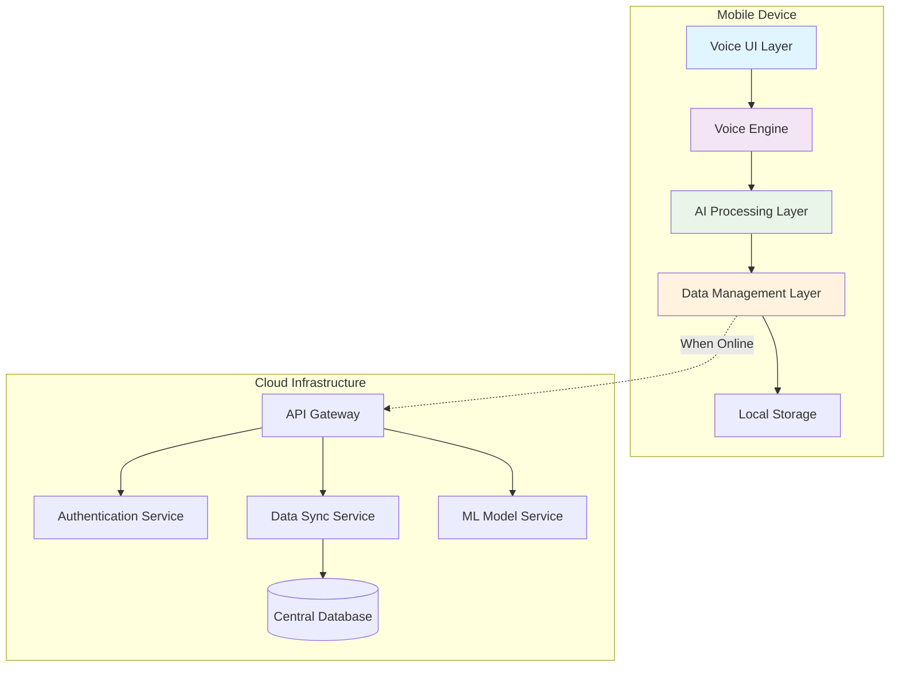
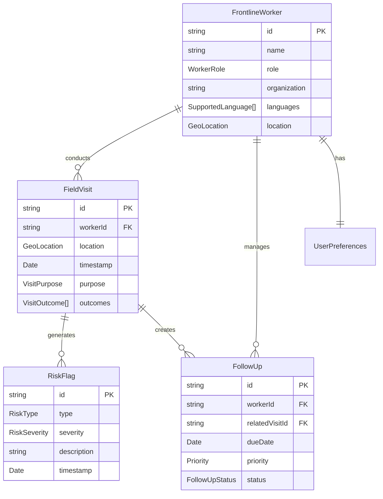

# Design Document: AI Companion for Frontline Workers

## Overview

The AI Companion for Frontline Workers is an offline-first, voice-centric mobile application designed to assist frontline workers in rural and underserved areas. The system employs a layered architecture with on-device AI processing, local data storage, and opportunistic cloud synchronization to ensure reliable operation in low-connectivity environments.

The design prioritizes simplicity, accessibility, and reliability while supporting multiple Indian regional languages. The system processes voice commands locally, maintains data integrity through conflict-free replicated data types (CRDTs), and provides intelligent assistance without requiring constant internet connectivity.

## Architecture

### High-Level Architecture



### Component Architecture

The system follows a modular architecture with clear separation of concerns:

1. **Voice UI Layer**: Handles user interactions through speech and minimal visual elements
2. **Voice Engine**: Manages speech-to-text, text-to-speech, and voice command processing
3. **AI Processing Layer**: Provides intelligent assistance, instruction simplification, and risk assessment
4. **Data Management Layer**: Handles local storage, synchronization, and conflict resolution
5. **Cloud Infrastructure**: Provides model updates, data backup, and cross-device synchronization

## Components and Interfaces

### Voice Engine Component

**Responsibilities:**
- Speech recognition in multiple Indian languages (Hindi, Tamil, Telugu)
- Text-to-speech synthesis with natural-sounding voices
- Noise filtering and voice activity detection
- Wake word detection for hands-free activation

**Key Interfaces:**
```typescript
interface VoiceEngine {
  startListening(language: SupportedLanguage): Promise<void>
  stopListening(): Promise<string>
  speak(text: string, language: SupportedLanguage): Promise<void>
  setWakeWordEnabled(enabled: boolean): void
  onVoiceCommand(callback: (command: VoiceCommand) => void): void
}

interface VoiceCommand {
  text: string
  confidence: number
  language: SupportedLanguage
  timestamp: Date
}
```

**Implementation Notes:**
- Uses on-device speech recognition models (based on research from Bhashini.ai and similar platforms)
- Implements voice activity detection to handle background noise
- Supports offline operation with pre-trained language models
- Provides fallback text input when voice recognition fails

### AI Processing Component

**Responsibilities:**
- Natural language understanding for voice commands
- Instruction simplification and step-by-step guidance
- Risk assessment based on predefined rules
- Context-aware response generation

**Key Interfaces:**
```typescript
interface AIProcessor {
  processCommand(command: VoiceCommand): Promise<AIResponse>
  simplifyInstructions(officialText: string): Promise<SimplifiedInstructions>
  assessRisk(caseData: CaseData): Promise<RiskAssessment>
  generateReminder(followUp: FollowUp): Promise<ReminderText>
}

interface AIResponse {
  type: 'instruction' | 'confirmation' | 'question' | 'error'
  content: string
  actions?: Action[]
  requiresFollowUp?: boolean
}

interface SimplifiedInstructions {
  title: string
  steps: InstructionStep[]
  keyPoints: string[]
  examples?: string[]
}
```

**Implementation Notes:**
- Uses lightweight NLP models optimized for mobile devices
- Implements rule-based risk assessment (no medical diagnosis)
- Provides context-aware responses based on user role and location
- Maintains conversation state for multi-turn interactions

### Data Management Component

**Responsibilities:**
- Local data storage and retrieval
- Conflict-free data synchronization
- Data encryption and security
- Offline-first data operations

**Key Interfaces:**
```typescript
interface DataManager {
  saveFieldVisit(visit: FieldVisit): Promise<string>
  getFieldVisits(filters: VisitFilters): Promise<FieldVisit[]>
  createFollowUp(followUp: FollowUp): Promise<string>
  getFollowUps(status: FollowUpStatus): Promise<FollowUp[]>
  syncWhenOnline(): Promise<SyncResult>
  exportData(format: ExportFormat): Promise<string>
}

interface FieldVisit {
  id: string
  workerId: string
  location: GeoLocation
  timestamp: Date
  purpose: string
  outcomes: string[]
  followUpsCreated: string[]
  riskFlags: RiskFlag[]
}
```

**Implementation Notes:**
- Uses SQLite for local storage with encryption
- Implements CRDT-based synchronization for conflict resolution
- Provides automatic backup and restore capabilities
- Supports data export in multiple formats (CSV, JSON)

### Synchronization Engine

**Responsibilities:**
- Background data synchronization when connectivity is available
- Conflict resolution using last-writer-wins with vector clocks
- Bandwidth-efficient delta synchronization
- Retry logic for failed synchronization attempts

**Key Interfaces:**
```typescript
interface SyncEngine {
  startBackgroundSync(): void
  stopBackgroundSync(): void
  forceSyncNow(): Promise<SyncResult>
  onSyncStatusChange(callback: (status: SyncStatus) => void): void
  resolveSyncConflicts(conflicts: SyncConflict[]): Promise<void>
}

interface SyncResult {
  success: boolean
  itemsSynced: number
  conflicts: SyncConflict[]
  lastSyncTime: Date
  nextSyncTime?: Date
}
```

## Data Models

### Core Data Entities

```typescript
// User and Authentication
interface FrontlineWorker {
  id: string
  name: string
  role: WorkerRole
  organization: string
  languages: SupportedLanguage[]
  location: GeoLocation
  deviceId: string
  lastActive: Date
}

// Field Operations
interface FieldVisit {
  id: string
  workerId: string
  beneficiaryId?: string
  location: GeoLocation
  timestamp: Date
  purpose: VisitPurpose
  duration: number
  outcomes: VisitOutcome[]
  notes: string
  photos?: string[]
  followUpsCreated: string[]
  riskFlags: RiskFlag[]
  syncStatus: SyncStatus
}

interface FollowUp {
  id: string
  workerId: string
  relatedVisitId: string
  title: string
  description: string
  dueDate: Date
  priority: Priority
  status: FollowUpStatus
  completedDate?: Date
  notes?: string
  syncStatus: SyncStatus
}

// Risk Assessment
interface RiskFlag {
  id: string
  type: RiskType
  severity: RiskSeverity
  description: string
  criteria: string[]
  timestamp: Date
  acknowledged: boolean
}

// System Configuration
interface UserPreferences {
  primaryLanguage: SupportedLanguage
  voiceEnabled: boolean
  wakeWordEnabled: boolean
  syncFrequency: SyncFrequency
  notificationSettings: NotificationSettings
}
```

### Data Relationships



Now I need to use the prework tool to analyze the acceptance criteria before writing the Correctness Properties section.

<function_calls>
<invoke name="prework">
<parameter name="featureName">ai-frontline-companion

## Correctness Properties

*A property is a characteristic or behavior that should hold true across all valid executions of a system—essentially, a formal statement about what the system should do. Properties serve as the bridge between human-readable specifications and machine-verifiable correctness guarantees.*

Based on the prework analysis and property reflection, the following properties ensure the system meets its requirements:

### Property 1: Language Consistency
*For any* voice interaction, when a frontline worker provides input in a specific language, the system response should be in the same language
**Validates: Requirements 1.1, 1.2**

### Property 2: Noise Filtering Effectiveness
*For any* speech input with background noise, the voice recognition system should correctly identify the primary speaker's words while filtering out noise
**Validates: Requirements 1.3**

### Property 3: Voice Recognition Error Handling
*For any* unclear or corrupted audio input that fails recognition, the system should request the user to repeat their input
**Validates: Requirements 1.4**

### Property 4: Instruction Simplification
*For any* complex official document or procedure, the AI system should break it down into numbered sequential steps using simple language
**Validates: Requirements 2.1, 2.2, 2.4**

### Property 5: Technical Term Explanation
*For any* input containing technical terms, the system should provide explanations in common language accessible to frontline workers
**Validates: Requirements 2.3**

### Property 6: Contextual Example Generation
*For any* clarification request, the system should provide examples relevant to the specific worker's role and context
**Validates: Requirements 2.5**

### Property 7: Complete Data Capture
*For any* field visit or follow-up entry, the system should capture all required fields (location, time, purpose, outcomes) regardless of input method
**Validates: Requirements 3.1, 3.2, 3.3, 4.1**

### Property 8: Offline-Online Data Consistency
*For any* data operation, records created offline should be identical to those created online, and synchronization should preserve data integrity
**Validates: Requirements 3.4, 3.5, 6.1, 6.2, 6.3**

### Property 9: Follow-up Management
*For any* follow-up task, the system should maintain chronological ordering, provide timely notifications, and correctly update status upon completion
**Validates: Requirements 4.2, 4.3, 4.4, 4.5**

### Property 10: Risk Assessment Boundaries
*For any* case data input, the system should evaluate against predefined criteria and create appropriate risk flags without providing medical diagnosis or treatment recommendations
**Validates: Requirements 5.1, 5.2, 5.3, 5.4, 5.5**

### Property 11: Sync Conflict Resolution
*For any* data synchronization conflict, the system should consistently apply the most recent data rule while maintaining audit trails
**Validates: Requirements 6.5**

### Property 12: Caching Behavior
*For any* frequently accessed guideline or instruction, the system should cache it locally for offline availability
**Validates: Requirements 6.4**

### Property 13: Security and Encryption
*For any* data storage or transmission operation, the system should apply appropriate encryption and security protocols while maintaining role-based access control
**Validates: Requirements 7.1, 7.2, 7.3, 7.4**

### Property 14: Response Time Performance
*For any* voice query under normal or high load conditions, the system should respond within the specified time limits (3 seconds normal, 5 seconds high load)
**Validates: Requirements 8.1, 8.2**

### Property 15: User Interface Accessibility
*For any* user interaction, the system should provide appropriate voice prompts, clear visual elements, and actionable error messages
**Validates: Requirements 9.1, 9.2, 9.3, 9.4**

### Property 16: Data Integration and Export
*For any* data exchange or export operation, the system should maintain format compatibility and provide graceful degradation when integration fails
**Validates: Requirements 10.1, 10.2, 10.3, 10.4, 10.5**

## Error Handling

### Voice Recognition Errors
- **Low Confidence Recognition**: When speech recognition confidence falls below threshold, request user to repeat
- **Language Detection Failure**: Fall back to user's primary language setting
- **Audio Quality Issues**: Provide guidance on optimal speaking conditions
- **Wake Word False Positives**: Implement confirmation mechanisms for critical actions

### Data Synchronization Errors
- **Network Timeout**: Implement exponential backoff retry strategy
- **Sync Conflicts**: Apply last-writer-wins with vector clock timestamps
- **Storage Full**: Implement data archiving and cleanup policies
- **Corruption Detection**: Use checksums and data validation on sync

### AI Processing Errors
- **Context Understanding Failure**: Provide clarifying questions to gather more context
- **Instruction Simplification Failure**: Fall back to original text with warning
- **Risk Assessment Uncertainty**: Flag for manual review rather than auto-classify

### Integration Errors
- **API Failures**: Continue operating independently with local data
- **Authentication Errors**: Provide clear re-authentication prompts
- **Data Format Mismatches**: Log errors and attempt format conversion

## Testing Strategy

### Dual Testing Approach

The system requires both unit testing and property-based testing for comprehensive coverage:

**Unit Tests** focus on:
- Specific examples of voice commands in each supported language
- Edge cases like empty inputs, malformed data, and boundary conditions
- Integration points between components
- Error conditions and recovery scenarios
- Specific UI interactions and accessibility features

**Property-Based Tests** focus on:
- Universal properties that hold across all valid inputs
- Comprehensive input coverage through randomization
- Data consistency across offline/online operations
- Performance characteristics under various load conditions

### Property-Based Testing Configuration

- **Testing Framework**: Use Hypothesis (Python) or fast-check (JavaScript/TypeScript) for property-based testing
- **Test Iterations**: Minimum 100 iterations per property test to ensure statistical confidence
- **Test Tagging**: Each property test must reference its design document property using the format:
  - **Feature: ai-frontline-companion, Property {number}: {property_text}**

### Testing Priorities

1. **Critical Path Testing**: Voice recognition, data synchronization, and offline functionality
2. **Security Testing**: Encryption, authentication, and access control
3. **Performance Testing**: Response times, memory usage, and battery consumption
4. **Accessibility Testing**: Voice prompts, visual elements, and error messages
5. **Integration Testing**: API connectivity, data format compatibility, and webhook functionality

### Test Data Management

- **Synthetic Voice Data**: Generate test audio in multiple languages and noise conditions
- **Mock Government APIs**: Create test doubles for external system integration
- **Offline Simulation**: Test network disconnection and reconnection scenarios
- **Multi-device Testing**: Validate synchronization across different devices and platforms